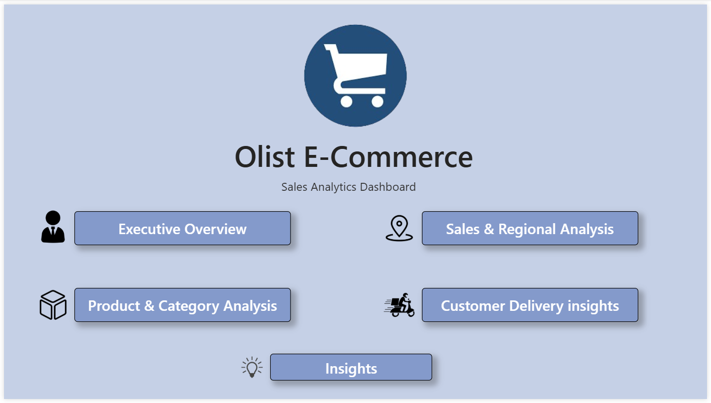

# 🛒 Olist E-Commerce Sales Analytics
### End-to-End Data Analytics Project | Excel · PostgreSQL · Power BI

---

## 📌 Project Overview

This is a **complete end-to-end sales analytics project** built on real Brazilian e-commerce data from Olist — Brazil's largest marketplace connecting small businesses to major retail channels.

The project follows a professional data analytics pipeline:

**Data Cleaning → SQL Analysis → Power BI Dashboard → Business Insights**

> **Why Olist?** Unlike the commonly used Superstore dataset, Olist provides 8 real relational tables with 100,000+ orders — closely resembling actual company data and requiring real schema design, multi-table joins, and business thinking.

---

## 🎯 Problem Statement

Olist processes thousands of orders across Brazil but lacks a unified view of sales performance, customer behaviour, and seller quality. This project answers 6 core business questions:

1. Which product categories and states drive the most revenue?
2. How has order volume and revenue trended from 2016 to 2018?
3. Are most customers one-time buyers or repeat purchasers?
4. Does delivery speed directly affect customer satisfaction?
5. Which sellers are top performers?
6. Does paying in installments correlate with higher order values?

---

## 📊 Dashboard

> **Power BI Dashboard (Interactive — 5 pages with navigation):**
> 🔗 [View Full Dashboard on Google Drive](https://drive.google.com/file/d/1Gi7f0wqDE6cV7YXObrc5nQsFUnkdBGJo/view?usp=sharing)

**Dashboard Pages:**
- 🏠 Home — Navigation cover page

- 📊 Executive Overview — KPIs, revenue trend, order status
- 🗺️ Sales & Regional Analysis — Brazil shape map, state rankings, payment types
- 📦 Product & Category Analysis — Top categories, treemap, avg price
- 👥 Customer & Delivery Insights — Satisfaction, delivery correlation, installments

---

## 🗂️ Repository Structure

```
olist-ecommerce-sales-analytics/
│
├── 📁 1_Raw_Data/
│   └── README.md                        ← Kaggle dataset download instructions
│
├── 📁 2_Cleaned_Data/
│   └── olist_data_dictionary.xlsx       ← Full column documentation across all 7 tables
│
├── 📁 3_SQL_Scripts/
│   ├── 01_basic_analysis.sql            ← Revenue, trends, categories, states, sellers
│   ├── query1_revenue_overview.csv      ← R$15.84M GMV summary
│   ├── query2_monthly_revenue.csv       ← Month-by-month growth 2016–2018
│   ├── query3_category_revenue.csv      ← Top 10 categories by revenue
│   ├── query4_state_revenue.csv         ← Revenue by Brazilian state
│   ├── query5_top_sellers.csv           ← Top 10 sellers ranked by revenue
│   ├── query6_delivery_vs_reviews.csv   ← Delivery time vs satisfaction score
│   └── query7_installments.csv          ← Installments vs avg order value
│
├── 📁 4_Dashboard/
│   └── dashboard_link.md               ← Google Drive link to .pbix file
│
├── 📁 5_Reports/
│   └── olist_insights_report.pdf        ← Full 5-page business insights report
│
└── README.md
```

---

## 🛠️ Tools & Technologies

| Tool | Purpose |
|---|---|
| **Microsoft Excel** | Data cleaning, VLOOKUP, derived columns, data dictionary |
| **PostgreSQL 17** | Database design, star schema, SQL analysis |
| **Power BI Desktop** | Interactive dashboard, DAX measures, Shape Map |
| **pgAdmin 4** | PostgreSQL GUI for query writing and data import |

---

## 🗄️ Database Schema

The dataset consists of **8 relational tables** imported into PostgreSQL and modelled as a star schema:

```
                    ┌─────────────────────┐
                    │  category_translation│
                    └──────────┬──────────┘
                               │
┌──────────────┐    ┌──────────▼──────────┐    ┌──────────────────┐
│   customers  │───▶│       orders        │◀───│   order_reviews  │
└──────────────┘    └──────────┬──────────┘    └──────────────────┘
                               │
              ┌────────────────┼────────────────┐
              │                │                │
    ┌─────────▼──────┐  ┌──────▼─────┐  ┌──────▼───────────┐
    │  order_items   │  │  payments  │  │     products      │
    └─────────┬──────┘  └────────────┘  └──────────────────┘
              │
    ┌─────────▼──────┐
    │    sellers     │
    └────────────────┘
```

---

## 🔍 SQL Analysis Highlights

### Basic Analysis (01_basic_analysis.sql)

```sql
-- Total Revenue Overview
SELECT
    COUNT(DISTINCT o.order_id)                          AS total_orders,
    ROUND(SUM(oi.price)::NUMERIC, 2)                    AS total_revenue,
    ROUND(SUM(oi.price + oi.freight_value)::NUMERIC, 2) AS total_gmv
FROM orders o
JOIN order_items oi ON o.order_id = oi.order_id
WHERE o.order_status = 'delivered';
-- Result: 96,478 orders | R$13.2M revenue | R$15.4M GMV
```

```sql
-- Delivery Time vs Review Score (CTE)
WITH delivery_analysis AS (
    SELECT
        r.review_score,
        DATE_PART('day',
            o.order_delivered_customer_date - o.order_purchase_timestamp
        ) AS actual_delivery_days,
        CASE
            WHEN o.order_delivered_customer_date <= o.order_estimated_delivery_date
            THEN 'On Time' ELSE 'Late'
        END AS delivery_status
    FROM orders o
    JOIN order_reviews r ON o.order_id = r.order_id
    WHERE o.order_status = 'delivered'
)
SELECT
    delivery_status,
    ROUND(AVG(review_score)::NUMERIC, 2)         AS avg_review_score,
    ROUND(AVG(actual_delivery_days)::NUMERIC, 1) AS avg_delivery_days
FROM delivery_analysis
GROUP BY delivery_status;
-- Result: On Time = 4.29 stars | Late = 2.57 stars (40% drop!)
```

---

## 💡 Key Insights

| # | Insight | Finding |
|---|---|---|
| 1 | **Order Completion** | 97% completion rate — above industry avg of 90–95% |
| 2 | **Revenue Growth** | Grew from 1 order (Sep 2016) to 7,289 orders (Nov 2017) |
| 3 | **Geographic Concentration** | Sao Paulo = 38.3% of total revenue — concentration risk |
| 4 | **Top Category** | Health & Beauty leads at R$1.23M revenue |
| 5 | **Retention Crisis** | 93.6% of customers never return — critical problem |
| 6 | **Payment Behaviour** | 73.9% credit card · 19% Boleto (unbanked segment) |
| 7 | **Delivery Impact** | Late deliveries cause 40% satisfaction drop (4.29 → 2.57 stars) |
| 8 | **Installment Effect** | 10-installment customers spend 333% more (R$415 vs R$96) |

---

## 📋 Recommendations

1. **Launch Customer Retention Program** — 93.6% one-time buyers is unsustainable
2. **Optimise Late Deliveries** — directly causes 40% satisfaction drop
3. **Expand Beyond Sao Paulo** — RJ, MG, BA show untapped premium potential
4. **Promote Installment Options** — proven to drive 333% higher order values
5. **Support Boleto Segment** — partner with digital wallets for unbanked customers

> 📄 Full detailed recommendations with projected business impact:
> [View Insights Report (PDF)](5_Reports/olist_insights_report.pdf)

---

## 📈 Data Cleaning Summary

| File | Rows | Key Cleaning Steps |
|---|---|---|
| orders | 99,441 | Split timestamps, flagged nulls, delivery status column |
| products | 32,951 | VLOOKUP Portuguese → English, fixed typos, quality flag |
| order_items | 112,650 | Created total_item_value derived column |
| payments | 103,886 | Flagged not_defined payment types, counted payment types |
| customers | 99,441 | Repeat customer flag, state analysis |
| sellers | 3,095 | State distribution analysis |
| reviews | 99,224 | Sentiment labels (Positive/Neutral/Negative), comment flag |

---


## 👤 Author

**Vijay Sharma** — Data Analyst

[](https://github.com/vijaysharmafin)

---

## 📦 Dataset Credit

- **Source:** [Olist Brazilian E-Commerce Dataset](https://www.kaggle.com/datasets/olistbr/brazilian-ecommerce) — Kaggle
- **Tables:** 8 relational tables · **Orders:** 99,441
- **Period:** September 2016 – August 2018
- **Country:** Brazil · **Currency:** Brazilian Reais (R$)

---

*Built as a portfolio project demonstrating end-to-end data analytics across cleaning, SQL analysis, dashboard development, and business insight generation.*
